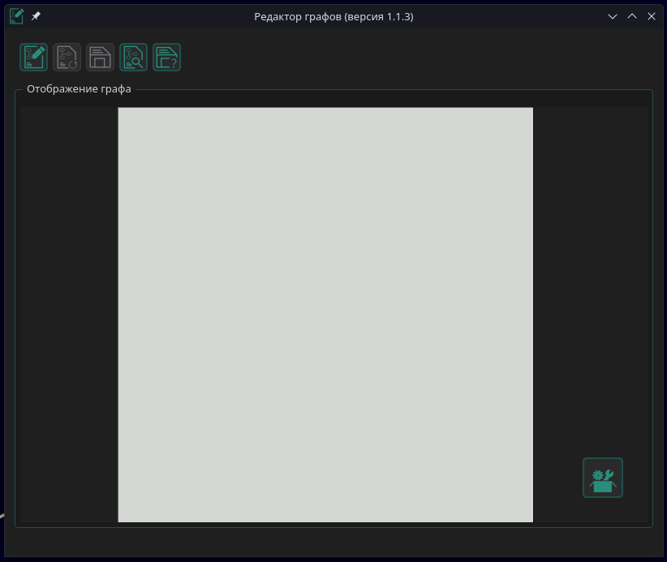
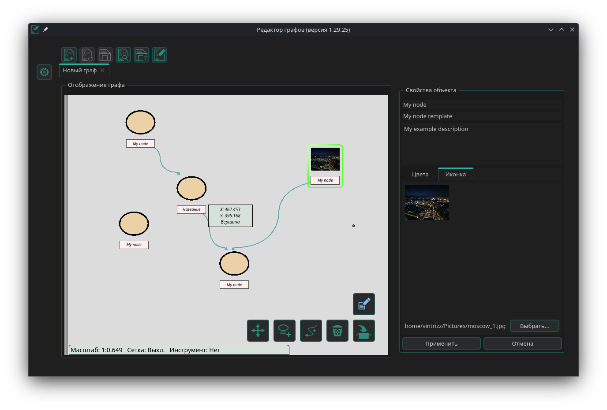

# Редактор графов

## Общая информация
Редактор предназначен для работы с собственным форматом графов (вдохновлён Maltego).  
**Релиз версии 1.0.0**  
Реализован базовый функционал редактирования;  
Сохранение графов реализовано в формате **GSE**.  
В ближайшей версии планируется поддержка форматов:
- **GSJ** (Graph Editor JSON)
- **GSEJ** (Graph Editor JSON Encrypted с шифрованием)

## Зависимости
- Qt 5
- CMake
- Boost::program_options (будет удалён в следующей версии)
- OpenSSL

## Настройка
_Требуется установка зависимостей. Проект находится в активной разработке._

## Использование
- Сохранение/загрузка графов в формате GSE, GSJ, GSJE
- Базовое редактирование элементов графа
- _Планируется расширение функциональности в следующих релизах_

## Известные баги
_Некоторые функции находятся в стадии реализации. Актуальный список багов ведётся в issue tracker._

## Скриншоты
1. Стартовое окно  

2. Режим редактирования графов (вершин и соединений)  

   _Планируемые режимы:_
   - Режим обзора/интеракции (с поиском по элементам графа)
   - Построение связей между сущностями (с возможностью применения в цифровой криминалистике)
   - Алгоритмический анализ (анализ работы алгоритмов с их оформлением по ГОСТ)

## Планы
Все планы находятся в раздела Issues репозитория