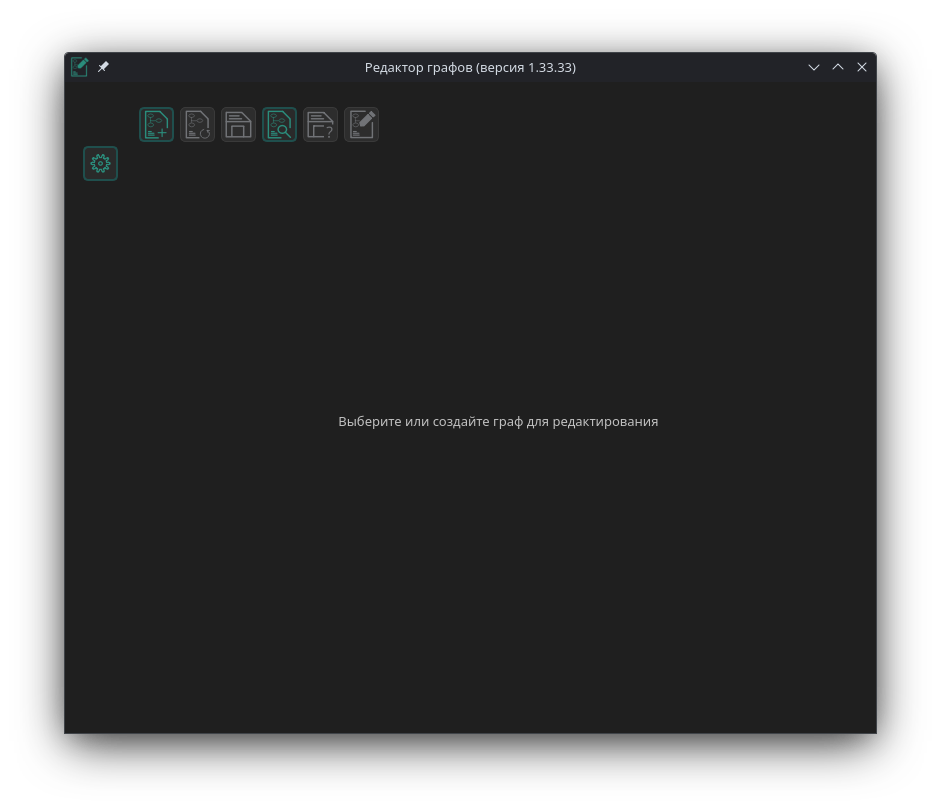

# Редактор графов

## Общая информация
Редактор предназначен для работы с собственным форматом графов.  
В дальнейшем планируется поддержка стандартных форматов сохранения графа

## Планы
Все планы по улучшению проекта (как реализованные, так и будущие) находятся в разделе Issues репозитория проекта

## Зависимости для сборки (Linux)
- Qt 5
- CMake версии не ниже 3.7
- GCC актуальной версии
- OpenSSL актуальной версии

## Настройка
Сборка для Windows не настроена, но имеет аналогичные сборке под Linux зависимости. При необходимости возможна сборка версии под Windows.  
При использовании AppImage версии проекта, дополнительных настроек не требуется. Версия полностью самодостаточна;  
Для сборки проекта необходимо установить зависимости, после чего в директории Deploy выполнить команду  
```bash
bash ./createAppImage.sh
```
после чего при успешной сборке в директории Results появится директория с AppImage проекта.  
Установка в качестве пакета на данной стадии проекта не предполагается.

## Известные баги
1) Иногда не отображается выделение элемента выбранным при взаимодействии
2) Иногда некорректно отображается указатель-маркер
3) При попытке открыть свойства графа, если открыты свойства объекта, они скроются

## Демонстрация функционала

### Стартовое окно


### Создание нового графа


### Изменение свойств графа


### Граф после сохранения в одном из форматов


### Граф со включенной сеткой


### Граф со включенной сеткой


### Граф со включенной сеткой


### Основные настройки приложения


### Настройки цветов
